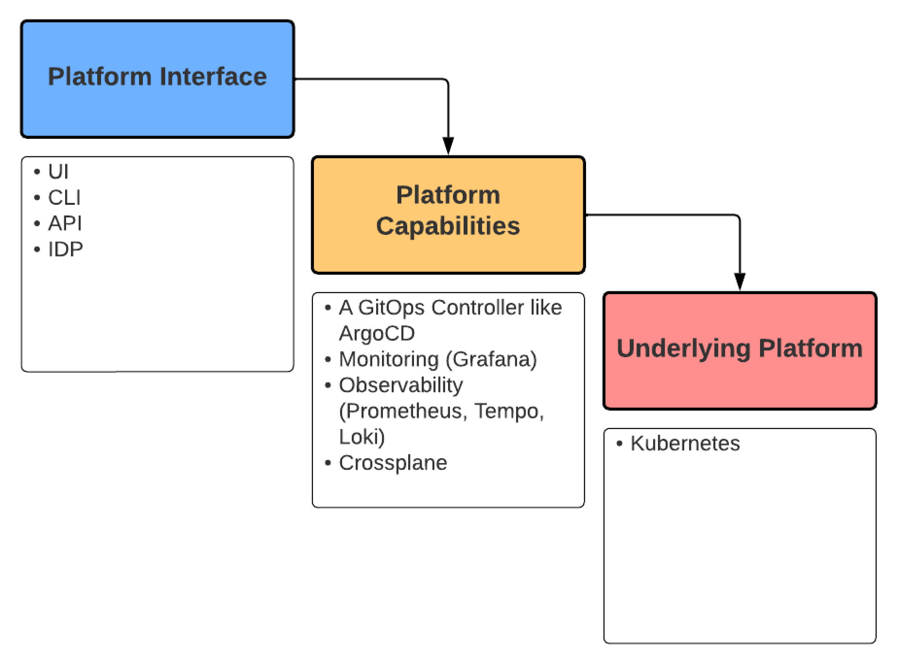
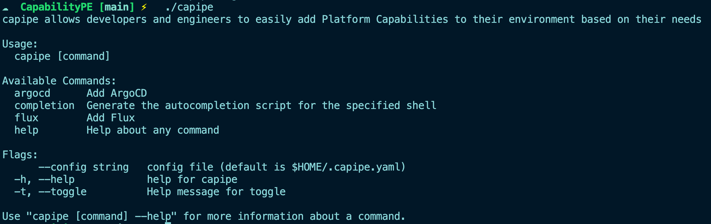

# CapabilityPE (capipe)

<p align="center">
 
</p>

You know what’s missing? An easy tool that just installs capibilities (ArgoCD, Datadog, KubeVirt, etc.) in an easy way. One command to do it all.

A tool that easily gets whatever capabilities you want your kubernetes cluster to have deployed in production.

`capipe`, which stands for Capibility Platform Engineering, allows you to specify capabilities that you want to install within your Platform Engineering environment.

## Why?

The two biggest questions I get are:
1. What tools should I use?
2. How can I easily deploy a production environment?

Those questions are why I made CapiPE.

Easily deploy what you need in a Kubernetes cluster with one command.

## Dependencies

1. Helm

## What's Coming...

- One command to install a Kubernetes cluster
    - Terraform configuration within the Capipe directory
    - Use the following Go library: https://github.com/hashicorp/terraform-exec
    - Use an `input` function in Go to prompt engineers to enter the variable information OR use it as flags within the CapiPE command line
- One command to install multiple Platform Capabilities
    - Platform Capabilities installed based on a particular stack you choose
        - App stack 1:
            - ArgoCD
            - OPA
            - Datadog
        - App stack 2:
            - Kyverno
            - Radius
            - Flux CD
            - Grafana/Prometheus/Tempo/Loki
        - App stack 3:
            - Crossplane
            - ArgoCD
            - Signoz

            




## Command Examples



Add a GitOps Controller

```
capipe argocd
```

```
capipe flux
```

Use flags
```
./capipe datadog --apikey "" --clustername ""
```

## WIP

Still working on it! Right now it contains the ability to add Flux and ArgoCD as GitOps Controllers.

